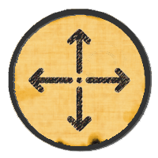

The **major** version number in my modules (like "12") always reflects the
Foundry VTT **core** version it is compatible with (and recommended for).

## 13.0.4
### 2025-10-01 - Cross-compatibility for [Hot Pan & Zoom!](https://github.com/coffiarts/FoundryVTT-hot-pan)'s new HUD Icon
You may have noticed that this mod now has a nice HUD Status Icon since the last updates. 
Howeder, as my other mod [Hot Pan & Zoom!](https://github.com/coffiarts/FoundryVTT-hot-pan) (feel free to check it out as well!) complained about this bitterly, I had to give it such an icon, too.

Well, now both icons need to get along in the UI with each other, so that they don't interfere or overlap.
That's what this technical update ensures.
**Important:** If you're already using both mods, make sure to update both of them, to avoid flaws in the UI!

## 13.0.3
### 2025-09-29 - Post-polishing of the preceding v13 hotfix
Addendum to the previous hotfix (which I had to push out as quickly as possible first, now here are some improvements to it):
- Now it is handled properly for Foundry versions 13 and 12, and also made clear in the settings menu by some warning notes.
- It's apparently the in-scene overlays that were causing the issue in v13, and it seems to affect only very large scenes and/or worlds.
- In-scene overlays are now disabled by default, but can be enabled in the settings menu. If you're facing scene loading lag while overlays are on, I recommend to keep them off and rely on the HUD icon (top-right corner) instead.
- The tradeoff for v13 remains as described for the original hotfix below: When overlays are on, and tokens are added to an already loaded scene, their lock overlays won't show until either toggling the lock state at least once, or reloading the scene. But I believe it's an acceptable price for avoiding the nasty scene loading lags.

## 13.0.2
### 2025-09-29 - Hotfix for v13
Critical fix for scenes in v13 taking ages to load or even crashing. A code line in my mod had to be removed.
It was there to make sure that tokens that are added to the scene after it has loaded show their lock overlay immediately.
But that's apparently not possible anymore in this way in v13 without causing issues.
The tradeoff now is that tokens added after scene loading will show overlays only after toggling the lock state at least once.

## 13.0.1
### 2025-09-28 - Tiny fix for the UI Button
Fix for the UI Button also showing for non-GM users. Didn't do any harm, but it was unnecessary and potentially confusing.

## 13.0.0
### 2025-09-17 - v13 compatibility is finally here- including a complete overhaul!
This module is now **fully migrated to Foundry VTT v13** (and also still backwards-compatible with v12). 
**Supported game systems are (as before):** dnd5e and tde5/dsa5.
If you need it for other systems, feel free to request it by open an issue on github. 
It's not the same as before - I have given it a **huge revamp**, so that it can now be considered much more reliable, stable, and clean. 

- Many things have been rewritten from scratch, so it's significantly more efficient and stable.
- Locking is much more reliable and predictable. It even uses the existing lock buttons/sliders in Actor Sheets from the game systems.
- Overlay icons now rendered cleanly as Sprites, i.e. there's no ugly abuse anymore of Status Effects to simulate the lock overlays.  => IMPORTANT NOTE: When upgrading from the v12 version, make sure to remove any such Status Effects (named "Sheet Lock") from your Actors. Those nasty bastards won't be needed anymore and would only cause issues. Sorry for having added them with the v12 version - just didn't know how to do better back then :-(
- UI functionalities (toggle button, keybindings) have been stabilized and significantly extended.
- I generally recommend to cleanly uninstall the v12 version first, before installing the v13 version. But be aware that this does NOT purge the potentially persistent Status Effects mentioned above ("Sheet Lock"). If they're still there, you'll have to remove them manually (sorry once again for the trouble!)

## 12.0.2
### 2025-08-05 - Just a note on v13 NON-compatibility
- THIS IS OBSOLETE NOW. But I'll keep it here for the sake of completeness.
- This mod is now compatible with Foundry VTT v13, since issue [#6](https://github.com/coffiarts/FoundryVTT-lock-the-sheets/issues/6) has been resolved

## 12.0.1
### 2024-10-06 - Hotfix for dsa5/tde5 version 6.x
- Game system dsa5/tde5 (Das Schwarze Auge/The Black Eye) seems to have changed its handling of active effects in latest version 6.x. That was causing a breaking bug in this mod, blocking certain rolls for actors in scene. This is the fix for it.

## 12.0.0
### 2024-06-06 - v12 compatibility
- Self-explaining. No functional changes. Well, apart from ...
- ... one technical detail (for those loving such details): Due to breaking changes in v12, overlay icons on scene tokens are now rendered differently (as Active Effects, which show up in character sheets, but may be ignored). From a user's point of view this is irrelevant. Even erratically changing or deleting such effects from a sheet won't break anything.
- Still backward-compatible with v11.

## 11.0.3
### 2024-04-02 - Keybinding support
- Adds an optional keybinding for toggling sheet lock on/off (gamemasters only).
- "Optional" means: There's no preassigned key combination. Assign it to your liking in the game settings (or ignore it if you don't want to use it). My personal preference is **SHIFT + L**.

## 11.0.2
### 2023-12-21 - Add missing changelog & readme to release package
That's why Module Management+ wasn't providing links to them in game (in case anyone should have noticed that groundbreaking detail).

## 11.0.1
### 2023-12-20 - Just an x-mas cleanup release :-)
- Several internal refactorings and stability optimizations that have piled up over time.
- Mainly optimizes debug logging. Nothing vital, just wanted to push this out before x-mas, so that there's room for hopefully more interesting features in the future.

## 11.0.0
### 2023-12-19 - First official release
Let's lock 'em all!