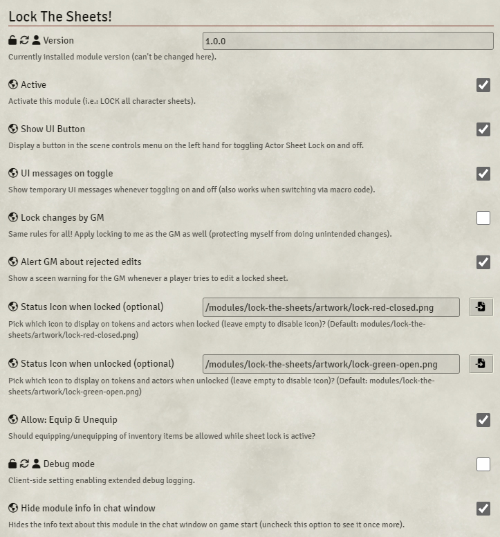

# TODO
- video (dnd5)
- finalize readme

# Lock The Sheets! for Foundry VTT
<table style="border:0">
  <tr>
    <td></td>
    <td> 
         
        <i><strong>Be the gatekeeper!</strong> 
           
          Lock and unlock all character sheets at once with just one click. 
          Never ever watch your players accidentally delete that beloved item from their inventory again ("Uuuugh... NOOOOO!")... 
          or let that nasty cheater among them mess around secretly with his hitpoints ("AAAAArrrrgh!").</i>
    </td>
  </tr>
</table>

## Video demo on youtube
[lock-the-sheets Demo](https://youtu.be/lock-the-sheets)

- [What does it do ...](#what-does-it-do-)
- [Changelog](#changelog)
- [Upcoming features](#upcoming-features)
- [Tech stuff](#tech-stuff)
  * [Adjustable module settings](#adjustable-module-settings)
  * [Control it by macro!](#control-it-by-macro)
  * [Compatibility and Dependencies](#compatibility-and-dependencies)

  <small><i><a href='http://ecotrust-canada.github.io/markdown-toc/'>Table of contents generated with markdown-toc</a></i></small>

## What does it do ...
With this nice little helper module the Game Master can block and unblock any edits to character sheets by the players.
This helps, for instance, to protect them from accidental changes.
And of course, if you're of the paranoid type, it prevents cheating.

***A slight warning:*** While sheets are locked, some intended changes may be suppressed, such as macro or chat triggered actions. But rest assured: There will be a screen message whenever that happens.
In such cases, just unlock the sheets and repeat the blocked action.

Toggling on/off works in various ways:
1. By a checkbox in the module settings 
2. Through a nice UI Button in the scene control on the left (which is optional and can be turned off in the setings, if you don't like it)
3. By macro code (a ready-to-use macro button is already included as a compendium pack).
 
Please refer to the various module preferences under game settings (as explained below).

## Changelog
See [CHANGELOG.md](CHANGELOG.md)

## Upcoming features
Feel free to follow the ["dev" branch on GitHub](https://github.com/coffiarts/FoundryVTT-lock-the-sheets/tree/dev) to stay tuned: [https://github.com/coffiarts/FoundryVTT-lock-the-sheets/tree/dev](https://github.com/coffiarts/FoundryVTT-lock-the-sheets/tree/dev)

Some things I am *considering* to do (feedback welcome!):

- `small`: some small feature
- `big`: some big feature

## Tech stuff
### Adjustable module settings
This screenshot shows the default values.

### Control it by macro
Use the exposed `class MyModuleMacroAPI` - just like this, it's a no-brainer:

Some more variants:

    // Toggle specifically on and off (pretty obvious)
    LockTheSheets.toggle();
    LockTheSheets.switchOn();
    LockTheSheets.switchOff();

### Compatibility and Dependencies
- Lock The Sheets! uses [socketlib](https://github.com/manuelVo/foundryvtt-socketlib) for sending sync messages between the GM's session and the clients.
