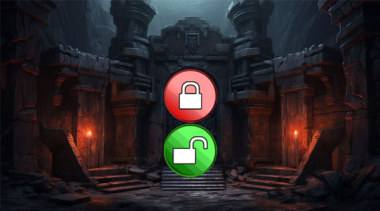
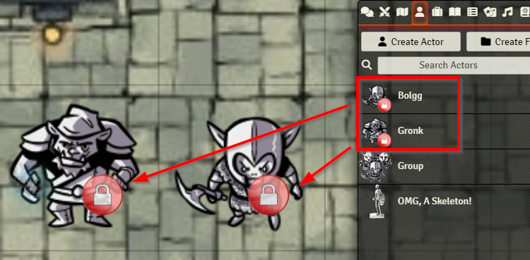
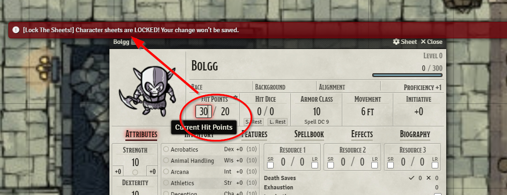
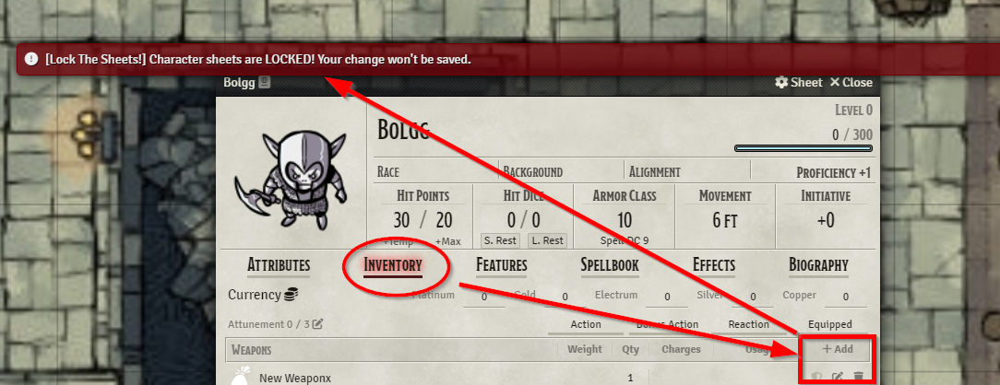
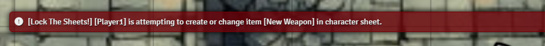

 

# Lock The Sheets! for Foundry VTT
<table style="border:0;width:840px">
  <tr>
    <td colspan="2"></td>
  </tr>
  <tr>
    <td style="width:200px"></td>
    <td style="width:640px"> 
         
        <i><strong style="color:#da6502">Oh Game Master, thou shalt be the gatekeeper!</strong> 
             
            Lock and unlock all your players' character sheets at once with just one click. 
            May you never ever again watch them accidentally delete that beloved item from their inventory ("Uuuugh... NOOOOO!")... 
            or let those nasty cheaters among them mess around secretly with their hitpoints ("AAAAArrrrgh!").</i>
    </td>
  </tr>
</table>

- [What it does ...](#what-it-does-)
- [Why I created this ...](#why-i-created-this-)
- [Changelog](#changelog)
- [Adjustable module settings](#adjustable-module-settings)
- [Control it by macro](#control-it-by-macro)
- [Compatibility and Dependencies](#compatibility-and-dependencies)
- [Copyrights and Credits for used assets](#copyrights-and-credits-for-used-assets)
  * [Goblins](#goblins)
  * [Banner](#banner)
  * [Lock icons](#lock-icons)

<small><i><a href='http://ecotrust-canada.github.io/markdown-toc/'>Table of contents generated with markdown-toc</a></i></small>

## What it does ...
With this nice little helper module the Game Master can block and unblock any edits to character sheets by the players.
This helps, for instance, to protect them from accidental changes.
And of course, if you're of the paranoid type, it prevents cheating.

Toggling on/off works in various ways:
1. By a checkbox in the module settings
2. Through a nice UI Button in the scene control on the left (optional, turn it off in the settings, if you don't like it)
3. By macro code (see below - a ready-to-use macro is already included).

In **default settings**, lock status is indicated by overlay icons, both in the scene and in the sidebar's actors list:

**These icons can be configured and also switched off in the module settings!**

**Lock ON:**

**Lock OFF:**

And it is even indicated in the **Combat Tracker** (thus reminding you that it should always bee **green** there, naturally):

Let's see what happens if players try to **manipulate their hitpoints:**

But apart from cheating prevention, let's see what happens if a player **accidentally** happens to **delete an inventory item:**

Even more, the **GM receives alerts about it** (optional, can be turned off):

## Why I created this ...
No, I did **not** create this out of paranoia towards my players!
IMO, role-playing is and has always been (since the Pen & Paper era) based on trust!

So it is not about cheating prevention (though it may serve for it as well!).

Instead, I am usually running hybrid, in-person game sessions with **children of age 10+**, who are permanently at risk of messing around with their character sheets.
I just wanted to protect them against arbitrary havok clicks.

Even more, it turned out that locking character sheets from time to time can bring even much more focus and relaxedness into the more narrative parts of role-playing (which I love more than combat action).
So the regular calls to order, like ...

_"Everybody now, get your hands off your sheets, stop clicking, lean back, listen and watch!"_

... are now replaced by a single, convenient button click. How I love it!

## Changelog
See [CHANGELOG.md](CHANGELOG.md)

## Adjustable module settings
This screenshot shows the default values.

## Control it by macro
A ready-to-use macro button for doing the toggle is already included as a compendium pack:

Use it as it is, or have a look inside how it works - it uses the exposed class `LockTheSheets` - it's a no-brainer:

    // Toggle (pretty obvious)
    LockTheSheets.toggle();
    // ON and OFF-only
    LockTheSheets.switchOn();
    LockTheSheets.switchOff();

## Compatibility and Dependencies
- Lock The Sheets! uses [socketlib](https://github.com/manuelVo/foundryvtt-socketlib) for sending sync messages between the GM's session and the clients.
- Heavily factory tested it myself with **dnd5e** and **tde5**. I cannot guarantee compatibility with other systems. But I consider it system-agnostic for now.
- ***Mild warning:*** While sheets are locked, some intended changes _may_ (in rare situations) be suppressed, such as macro or chat triggered actions. I put much effort into testing and I assume it's a rare case. Rest assured: There will be a screen message whenever that happens.
  In such cases, just unlock the sheets and repeat the blocked action. If this doesn't help, please report it as an issue on guithub.

## Copyrights and Credits for used assets
### Goblins
The cute, beloved badass goblins used in my screenshots have thankfully been published by [David Wilson](https://tools.2minutetabletop.com/token-editor/author?a=David%20Wilson) and [Hammertheshark](https://tools.2minutetabletop.com/token-editor/author?a=Hammertheshark) for free use on [https://tools.2minutetabletop.com](https://tools.2minutetabletop.com/) under the [CC BY 4.0 License](http://creativecommons.org/licenses/by/4.0/). I have grown so fond of them that they've become my special module demo'ing pets.
### Banner
The banner image with the dark fantasy portal was AI-created by myself.
### Lock icons
-  The **red** lock symbol was published by [UIHuBoro](https://commons.wikimedia.org/w/index.php?title=Template:UIHuBoro&action=edit&redlink=1) on [wikipedia](https://de.m.wikipedia.org/wiki/Datei:Ambox_padlock_red.svg) for free use under the [CC BY-SA 4.0 License](https://creativecommons.org/licenses/by-sa/4.0/). I have slightly edited it for my needs, as it is granted by that license
- The **green** lock symbol was created by myself by editing the red icon
-  The blue/violet UI/macro button image is actually the unmodified [user-lock](https://fontawesome.com/icons/user-lock?f=classic&s=solid) icon from [fontawesome.com](https://fontawesome.com/). There it is published under the [Font Awesome Free License](https://fontawesome.com/license/free), which in turn is (basically) a [CC BY 4.0 License](https://creativecommons.org/licenses/by/4.0/) 
