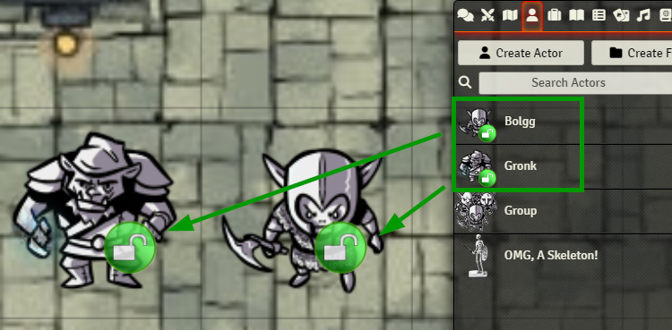

### v13-compatibility is finally here - including a complete overhaul!
This module is now **fully migrated to Foundry VTT v13** (and also still backwards-compatible with v12). 
**Supported game systems are (as before):** dnd5e and tde5/dsa5.
If you need it for other systems, feel free to request it by open an issue on github. 
It's not the same as before - I have given it a **huge revamp**, so that it can now be considered much more reliable, stable, and clean. 
Please have a look at the [CHANGELOG.md](CHANGELOG.md) for details, especially the **notes on migrating from v12 to v13**.

# Lock The Sheets! for Foundry VTT
<table style="border:0;width:840px">
  <tr>
    <td colspan="2"></td>
  </tr>
  <tr>
    <td style="width:200px"></td>
    <td style="width:640px"> 
         
        <i><strong style="color:#da6502">Oh Game Master, thou shalt be the gatekeeper!</strong> 
             
            Lock and unlock all your players' character sheets at once with just one click. 
            May you never ever again watch them accidentally delete that beloved item from their inventory ("Uuuugh... NOOOOO!")... 
            or let those nasty cheaters among them mess around secretly with their hitpoints ("AAAAArrrrgh!").</i>
    </td>
  </tr>
</table>

- [What it does ...](#what-it-does-)
- [Why I created this ...](#why-i-created-this-)
- [Changelog](#changelog)
- [Adjustable module settings](#adjustable-module-settings)
- [Toggle by hotkeys](#toggle-by-hotkeys)
- [Control it by macro](#control-it-by-macro)
- [Compatibility and Dependencies](#compatibility-and-dependencies)
- [Copyrights and Credits for used assets](#copyrights-and-credits-for-used-assets)
  * [Goblins](#goblins)
  * [Banner](#banner)
  * [Lock icons](#lock-icons)

<small><i><a href='http://ecotrust-canada.github.io/markdown-toc/'>Table of contents generated with markdown-toc</a></i></small>

- Are you on [Forge VTT](https://forge-vtt.com/)?
- Do you like my work?
- Do you REALLY like my work?
- Could you even imagine to DONATE?

Feel free to [head over to this mod on Forge](https://eu.forge-vtt.com/bazaar/package/lock-the-sheets), where you can even pay for it what you like.
This is absolutely optional! Don't feel obliged in any way to do so. My mod is and will remain available for free.

## What it does ...
With this nice little helper module the Game Master can block and unblock any edits to character sheets by the players.
This helps, for instance, to protect them from accidental changes.
And of course, if you're of the paranoid type, it can help as a cheating control (though it's not originally meant for that, see my comments below).

Toggling on/off works in various ways:
1. By a checkbox in the module settings
2. Through a nice UI Button in the scene control on the left (optional, turn it off in the settings, if you don't like it)
3. By custom keybindings (my recommendation: assign it to SHIFT + L)
4. By a macro (see below - ready-to-use macros already included as a compendium pack).

With **default settings**, lock status is indicated by overlay icons, both in the scene and in the sidebar's actors list:
**These icons can be configured and also switched off to your liking.**

**Lock ON:**

**Lock OFF:**

Let's see what happens if players try to **manipulate their hitpoints:**

And let's see what happens if a player **accidentally** happens to **delete an inventory item:**

Optionally, the **GM receives alerts about every blocked action**:

## Why I created this ...
No, I did **not** create this out of paranoia towards my players!
IMO, role-playing is and has always been (since the Pen & Paper era) based on trust! It is not about cheating prevention (though it may serve for it as well!).

Instead, I am usually running hybrid, in-person game sessions with **children of age 10++**, who are permanently at risk of messing around with their character sheets.
I just wanted to protect them against arbitrary havoc clicks.

Even more, it turned out that locking character sheets from time to time can bring even much more focus and relaxedness into the more narrative parts of role-playing (which I love more than combat action).
So the regular calls to order, like ...

_"Everybody now, get your hands off your sheets, stop clicking, lean back, listen and watch!"_

... are now replaced by a single, convenient button click. How I love it!

## Changelog
See [CHANGELOG.md](CHANGELOG.md)

## Adjustable module settings
There are tons of settings to adjust to your liking (just a few examples):
- showing token overlay icons for locked state (red), unlocked state (green), both (red and green), or none (off)
- scale overlay icons by 4 steps small, normal, large, zero (=invisibe)
- showing a toggle button in the scene control bar (optional, can be turned off)
- showing a prominent HUD icon indicating to everyone when the locks turn on or off (with optional fade-out time)
- showing on-screen messages to players
- showing on-screen messages to the GM when players are trying to edit their locked sheets
- you can even decide (as the GM) to lock yourself out from editing sheets (as a kind of self-protection against unintended havoc)

## Toggle by hotkeys
You (as the GM) can assign custom hotkeys in the game settings to
- toggle the lock status
- change the scale of overlay icons
- switch the UI button on/off (because some people consider it invasive to add custom buttons to the scene control bar, therefore it's strictly kept optional)

## Control it by macro
Some ready-to-use macro buttons are already included as a compendium pack:
- Toggle lock ON/OFF
- Change (cycle) the size of the overlay icons
- Toggle visibility of all overlay icons

Use it as it is, or have a look inside how it works - it uses the exposed class `LockTheSheets` - it's a no-brainer:

    // Toggle (pretty obvious)
    LockTheSheets.toggle();
    // ON and OFF-only
    LockTheSheets.switchOn();
    LockTheSheets.switchOff();
    // Cycle through the different sizes of the overlay icons
    LockTheSheets.changeOverlayScale();
    // Toggle overlay visibility
    LockTheSheets.toggleOverlays();

## Compatibility and Dependencies
- Lock The Sheets! uses [socketlib](https://github.com/manuelVo/foundryvtt-socketlib) for sending sync messages between the GM's session and the clients.
- Heavily factory tested by myself with **dnd5e** and **tde5/dsa5**. I cannot guarantee compatibility with other systems. It is **not** system-agnostic, as it relies on system-specific HTML injection. As mentioned above, I am happy about requests for compatibility with more systems - just open a github issue!
- ***Mild warning:*** While sheets are locked, some intended changes _may_ (in rare situations) be suppressed, such as macro or chat triggered actions. I put much effort into testing and I assume these are edge cases. Rest assured: There will be a screen message whenever that happens.
  In such cases, just unlock the sheets and repeat the blocked action. If this doesn't help, please report it as an issue on guithub.

## Copyrights and Credits for used assets
### Goblins
The cute, beloved badass goblins used in my screenshots have thankfully been published by [David Wilson](https://tools.2minutetabletop.com/token-editor/author?a=David%20Wilson) and [Hammertheshark](https://tools.2minutetabletop.com/token-editor/author?a=Hammertheshark) for free use on [https://tools.2minutetabletop.com](https://tools.2minutetabletop.com/) under the [CC BY 4.0 License](http://creativecommons.org/licenses/by/4.0/). I have grown so fond of them that they've become my special module demo'ing pets - like you can see here in my [demo video](https://youtu.be/ix66vZ8A0OI) for another module of mine, [Crunch My Party!](https://github.com/coffiarts/FoundryVTT-crunch-my-party)
### Banner
The banner image with the dark fantasy portal was AI-created by myself.
### Lock icons
-  The **red** lock symbol was published by [UIHuBoro](https://commons.wikimedia.org/w/index.php?title=Template:UIHuBoro&action=edit&redlink=1) on [wikipedia](https://de.m.wikipedia.org/wiki/Datei:Ambox_padlock_red.svg) for free use under the [CC BY-SA 4.0 License](https://creativecommons.org/licenses/by-sa/4.0/). I have slightly edited it for my needs, as it is granted by that license
- The **green** lock symbol was created by myself by editing the red icon
-  The blue/violet UI/macro button image is actually the unmodified [user-lock](https://fontawesome.com/icons/user-lock?f=classic&s=solid) icon from [fontawesome.com](https://fontawesome.com/). There it is published under the [Font Awesome Free License](https://fontawesome.com/license/free), which in turn is (basically) a [CC BY 4.0 License](https://creativecommons.org/licenses/by/4.0/) 
